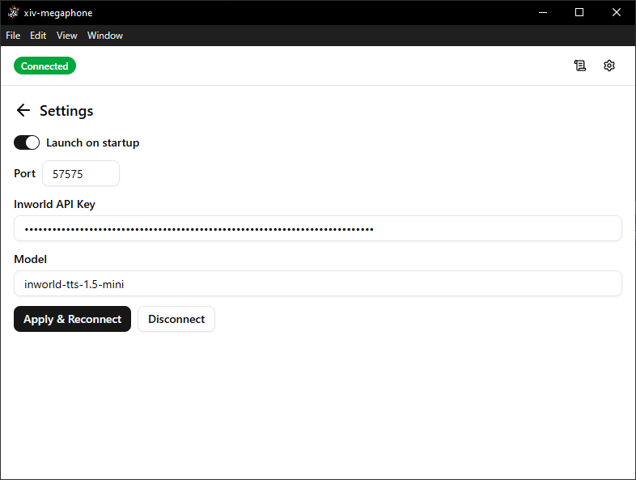

<div align="center">
  <h1>xiv-megaphone</h1>

  

  A Windows desktop application for managing TTS presets for FFXIV, built with Electron + React + Vite.
</div>

## Installation

1. Go to the [Releases](../../releases) page.
2. Download the latest `.exe` installer.
3. Run the installer and launch the application.

## Setup

### XIVLauncher / Dalamud Setup

The application will not show as connected until:

1. **XIVLauncher** is running.
2. The **TextToTalk** Dalamud plugin is installed and enabled.
3. TextToTalk is configured to use **WebSocket** mode.
4. The WebSocket port is set to `57575` (default), or your desired port

### 1. Create an Inworld API key

Create an API key at [inworld.ai](https://www.inworld.ai/).

Inworld currently includes **$10 of free evaluation credits per month**, which should be enough to try the app out.

### 2. Add your API key in the app

Open the app settings and paste your Inworld API key (and port, if different than the default).



### 3. Apply and restart

Click **Apply & Reconnect**, which will begin attempting to connect to the TextToTalk Dalamud plugin over the port you have configured.

### 4. Connection Notes

If the app says it is not connected, check the following:

XIVLauncher is currently running.
Dalamud is loaded.
The TextToTalk plugin is enabled.
TextToTalk is set to WebSocket mode.
The WebSocket port matches the port configured in the app.
After changing settings, click Apply and restart the app.

### 5. Presets

A default preset ships with the app and is selected by default. It has voices for all of the race/gender combos. These are stock inworld voices, so they won't match the game voice actors. I picked them somewhat at random, so feel free to change them by creating a new preset! **Have Fun!**

## Prerequisites

- [Node.js](https://nodejs.org/) 20.19+ (required by electron-vite)
- [Bun](https://bun.sh/) (package manager and script runner)

## Install

```sh
cd frontend
bun install
```

## Dev (with HMR)

```sh
bun run dev
```

Opens an Electron window. The renderer hot-reloads on file changes; the main process restarts on main/preload changes.

## Build

```sh
bun run build
```

Compiles all three processes to `out/`.

## Package (Windows installer)

```sh
bun run package:win
```

Produces an NSIS installer in `dist/`.

## Lint

```sh
bun run lint       # check
bun run lint:fix   # auto-fix
```

## Project structure

```
frontend/
  src/
    main/         # Electron main process (Node.js)
    preload/      # Preload script + window.electronAPI types
    mainview/     # React renderer (Vite + Tailwind + shadcn)
frontend-shared/  # Shared TypeScript types
```
