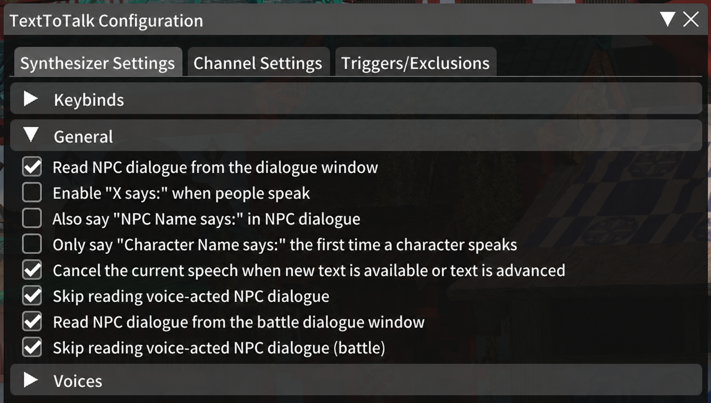
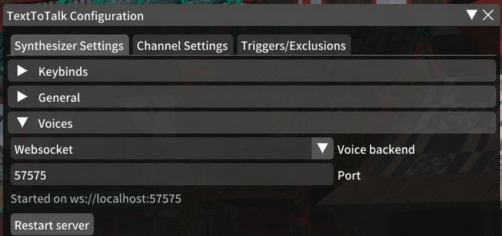

<div align="center">
  <h1>xiv-megaphone</h1>

  

  A Windows desktop application for managing TTS presets for FFXIV, built with Electron + React + Vite.
</div>

## How it works

TextToTalk intercepts NPC dialogue and emits it over a local WebSocket as JSON messages containing the speaker name, race, gender, and dialogue text. This app connects to that socket, selects a voice from the configured preset based on the NPC's race/gender, streams audio from the Inworld TTS API chunk by chunk, and plays it through your system speakers in real time. A cancel message from TextToTalk immediately stops playback.

## Why Inworld?

Inworld TTS consistently ranks among the top TTS models according to ELO. It's also surprisingly cheap, especially the mini model. Additionally, they provide $10 in free credits per month for evaluation purposes. It's an amazing deal! I fell in love with them months ago, and this was a fun opportunity for me to learn more about audio streaming while supporting one of my favorite models.

## Prerequisites

- **Final Fantasy XIV**
- **[XIVLauncher](https://goatcorp.github.io/)** — custom launcher that enables Dalamud plugins ([GitHub](https://github.com/goatcorp/FFXIVQuickLauncher))
- **[TextToTalk](https://github.com/karashiiro/TextToTalk)** — Dalamud plugin (install from the in-game plugin installer via XIVLauncher)

### TextToTalk Settings

In the TextToTalk plugin settings (`/tttconfig`):

#### General

**Synthesizer Settings** — enable:
- Read NPC dialogue from the dialogue window
- Cancel current speech when new text is available or advanced
- Skip reading voice-acted NPC dialogue
- Read NPC dialogue from the battle dialogue window
- Skip reading voice-acted NPC dialogue (battle)

Disable everything else. The "X says:" prefix is unnecessary noise.



#### Backend

set to **WebSocket** and configure the port (e.g. `57575`).



#### Channels

When starting out, I recommend in the Channel Settings tab, enable **NPC Dialogue** only. Disabling other channels avoids reading chat, emotes, and system messages.

## Installation

1. Go to the [Releases](../../releases) page.
2. Download the latest `.exe` installer.
3. Run the installer and launch the application.

## Setup

### XIVLauncher / Dalamud Setup

The application will not show as connected until:

1. **XIVLauncher** is running.
2. The **TextToTalk** Dalamud plugin is installed and enabled.
3. TextToTalk is configured to use **WebSocket** mode.
4. The WebSocket port is set to `57575` (default), or your desired port

### 1. Create an Inworld API key

Create an API key at [inworld.ai](https://www.inworld.ai/).

Inworld currently includes **$10 of free evaluation credits per month**, which should be enough to try the app out.

### 2. Add your API key in the app

Open the app settings and paste your Inworld API key (and port, if different than the default).


### 3. Apply and restart

Click **Apply & Reconnect**, which will begin attempting to connect to the TextToTalk Dalamud plugin over the port you have configured.

### 4. Connection Notes

If the app says it is not connected, check the following:

XIVLauncher is currently running.
Dalamud is loaded.
The TextToTalk plugin is enabled.
TextToTalk is set to WebSocket mode.
The WebSocket port matches the port configured in the app.
After changing settings, click Apply and restart the app.

### 5. Presets

A default preset ships with the app and is selected by default. It has voices for all of the race/gender combos. These are stock inworld voices, so they won't match the game voice actors. I picked them somewhat at random, so feel free to change them by creating a new preset! **Have Fun!**

## Voice selection

Voices are selected per-NPC using a priority chain:

1. Named speaker match (by speaker name, lowercased)
2. Race + gender match (e.g. `"au ra female"`)
3. Gender-only fallback (`male` / `female`)
4. Default voice

## Notes

- After any FFXIV patch, Dalamud becomes temporarily incompatible and plugins stop working for a few days — longer after an expansion launch. This is normal; wait for Dalamud and plugin updates to catch up before using this.
- The app must be running before you enter a dialogue that triggers speech. It does not replay missed lines.
- Only one instance should be running at a time.

# Development and Contributing

## Development Prerequisites

- [Node.js](https://nodejs.org/) 20.19+ required by electron-vite
- [Bun](https://bun.sh/) recommended package manager and script runner
- [Inworld account](https://platform.inworld.ai/signup) with an API key

## Install

```sh
cd frontend
bun install
```

## Dev (with HMR)

```sh
bun run dev
```

Opens an Electron window. The renderer hot-reloads on file changes; the main process restarts on main/preload changes.

## Build

```sh
bun run build
```

Compiles all three processes to `out/`.

## Package (Windows installer)

```sh
bun run package:win
```

Produces an NSIS installer in `out/make/[platform]`.

## Lint

```sh
bun run lint       # check
bun run lint:fix   # auto-fix
```
