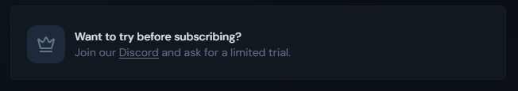
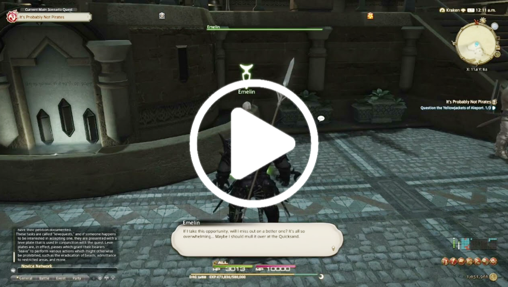
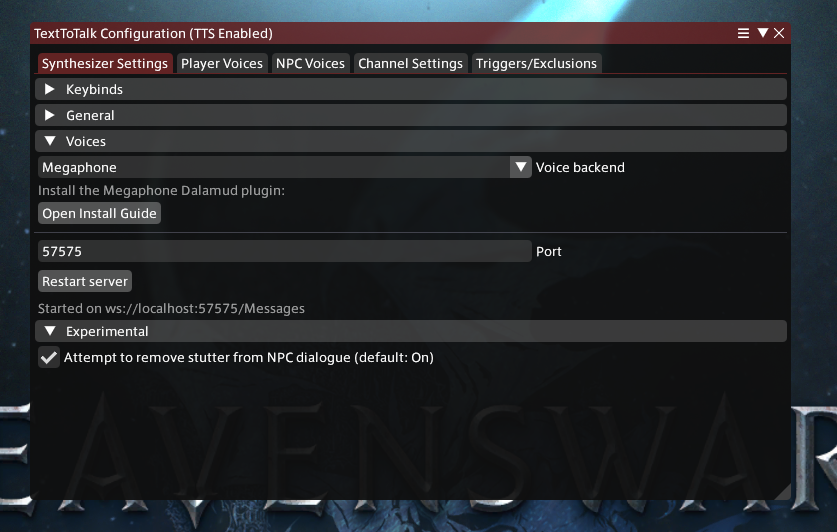
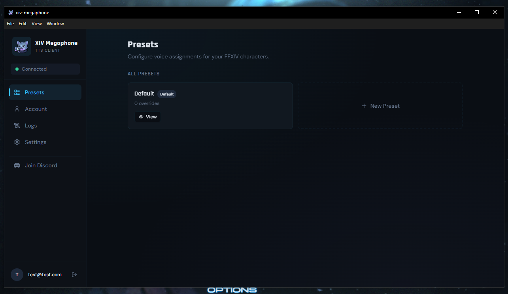
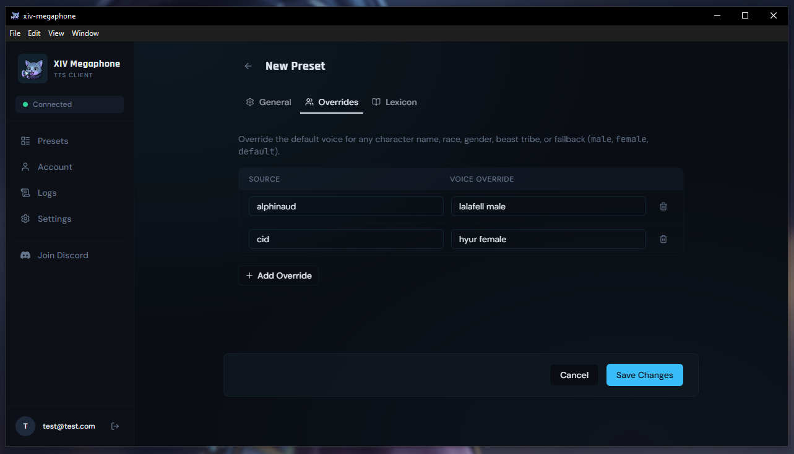
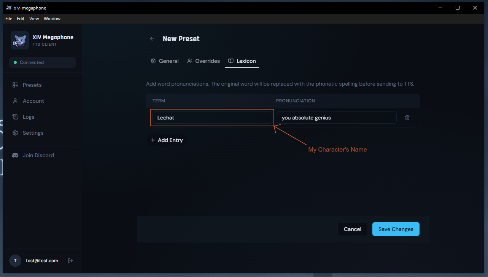

<div align="center">
  <h1>xiv-megaphone</h1>

  

  A Windows desktop application to simplify AI TTS for FFXIV, built with Electron + React + Vite.

  [](https://discord.gg/GSEuGqAGAf) [](https://github.com/barrcodes/xiv-megaphone/releases/latest)
</div>

## Trial Credits

This app is brand new, built solely by me, and completely bootstrapped with very minimal budget - hence there is no easy free trial sign-up. But if you want to help me beta test the app, I can spare a couple bucks in credit in return for feedback and testing!

[](https://discord.com/invite/GSEuGqAGAf)

### Watch the teaser

[](https://www.youtube.com/watch?v=SIuOKiCDvGE)

## Prerequisites

- **Final Fantasy XIV**
- **[XIVLauncher](https://goatcorp.github.io/)** — custom launcher that enables Dalamud plugins ([GitHub](https://github.com/goatcorp/FFXIVQuickLauncher))
- **[TextToTalk](https://github.com/karashiiro/TextToTalk)** — Dalamud plugin (install via the Dalamud plugin manager)

## Installation

1. Go to the [Releases](../../releases) page.
2. Download the latest `.exe` installer.
3. Run the installer and launch the application.
4. Create an account

## Setup

### Dalamud Setup

Install **TextToTalk** via the Dalamud plugin manager in-game. Starting with TextToTalk 1.39.2, Megaphone support is built in.

In the plugin settings, select **"megaphone"** from the provider dropdown in the Voices section — no other settings need to change out of the box.



### Presets

A default preset ships with the app and is selected automatically. It provides custom voices for all race/gender combinations as well as beast tribes and a few notable named NPCs out of the box. More voices and features to come!

### Volume Control

When connected, a volume slider appears in the sidebar. Volume is saved between sessions.

The final output volume combines three factors:
- **TextToTalk** sends the FFXIV master × voice volume from in-game
- **Gain** multiplier adjusts per-voice levels server-side (some voices are louder than others)
- **Volume slider** multiplier lets you tune down the volume of tts voices relative to in-game voices as desired

### Custom Voice Assignments & Lexicon



You can create a preset to add your own custom voices overrides! Make one character sound like another. Here I've set Alphinaud to sound like a Lalafell.



You can also add your own lexicon to make things sound the way you want them to! Get opinionated! My personal favorite is to change my character's name to something fun.



## Notes

- After any FFXIV patch, Dalamud becomes temporarily incompatible and plugins stop working for a few days — longer after an expansion launch. This is normal; wait for Dalamud and plugin updates to catch up before using this.
- The app must be running before you enter a dialogue that triggers speech. It does not replay missed lines.
- Only one instance should be running at a time.

# Development and Contributing

## Development Prerequisites

- [Node.js](https://nodejs.org/) 20.19+ required by electron-vite
- [Bun](https://bun.sh/) recommended package manager and script runner

## Install

```sh
./instal.sh
```

or

```powershell
./install.ps1
```

## Dev (with HMR)

```sh
cd frontend
bun run dev
```

Opens an Electron window. The renderer hot-reloads on file changes; the main process restarts on main/preload changes.

## Build

```sh
bun run build
```

Compiles all three processes to `out/`.

## Package (Windows installer)

```sh
bun run build:make
```

Produces an NSIS installer in `out/make/[platform]`.

## Lint

```sh
bun run lint       # check
bun run lint:fix   # auto-fix
```

---

<sub>The xiv-megaphone voice API follows the same protocol as [TextToTalk](https://github.com/karashiiro/TextToTalk), so TextToTalk can also be configured to use xiv-megaphone as its TTS provider. However, we recommend using the xiv-megaphone plugin for the best experience.</sub>
